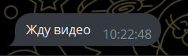
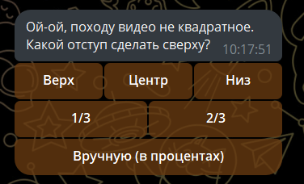
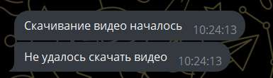

[](https://github.com/mymmrac/telego)


# TikTok & Circle Telegram Bot

Исходники бота для Telegram, который может скачивать видео с TikTok и переделывать видео в видеосообщение.

## Возможности
- Скачивание видео с TikTok
    - Наивысшее качество
    - Фото (до 10 шт.)
    - Обрезка чёрных полей по бокам (или сверху и снизу).
- Конвертация видео в видеосообщение
    - Если видео шире/выше квадрата, то предложит выбрать ширину/высоту по которой обрежит видео до квадрата.
- Прокси для скачиванию видео с TikTok
- Задание пароля для выключения бота через чат (требует включенного флага exit-ability)
- Поддержка групп

## Установка

```bash
git clone git@github.com:Alka-devel/tiktoktgcircle.git
cd tiktoktgcircle
go build
```

## Использование
Прямо из папки с проектом
```bash
go run . -token {botTokenFromBotFather} 
```
Реагирует на команды
- "/circle", "кружок" 
- Ссылка на tiktok
- "/exit" если включено

## Скриншоты

**Пример сообщения:**



**Обрезка чёрных полей:**



**Пример ошибки:**



## Аргументы и флаги

```
Usage: tiktoktgcircle [flags]

Flags:
  --token               токен бота от BotFather
  --ytdlp-path string   путь до yt-dlp (default %PATH%)
  --ffmpeg-path string  путь до ffmpeg (default %PATH%)
  --ffprobe-path string путь до ffprobe (default %PATH%)
  --proxy-port int      порт для прокси-сервера
  --proxy-ip string     IP-адрес для прокси-сервера
  --exit-ability bool   Если включено, то бота можно выключить написав в чат "/exit {pass}" (default false)
  --exit-pass string    пароль для выключения бота из чата, работает только с флагом --exit-ability (default 0000)
  -h, --help            показать справку
```
Пример с прокси и защитой от выключения:

```bash
go run . --token 123:ABC --proxy-ip 192.168.0.6 --proxy-port 1984 --exit-ability true --exit-pass mypass
```
## Требования

- Go 1.26.7+
  
## Зависимости

Внешние утилиты должны быть доступны в PATH (либо путь передаётся явно):

| Инструмент | Требования | Проверить |
|------------|-----------|-----------|
| [yt-dlp](https://github.com/yt-dlp/yt-dlp) | рекомендуется обновлять регулярно (`yt-dlp -U`) — старые версии перестают работать из-за изменений на стороне видеохостингов | `yt-dlp --version` |
| [ffmpeg](https://ffmpeg.org/) | 4.0+, обязательно собран с поддержкой libx264 | `ffmpeg -version` |
| [ffprobe](https://ffmpeg.org/ffprobe.html) | идёт в комплекте с ffmpeg, отдельно версия не важна | `ffprobe -version` |

## Лицензия

MIT — см. [LICENSE](LICENSE)